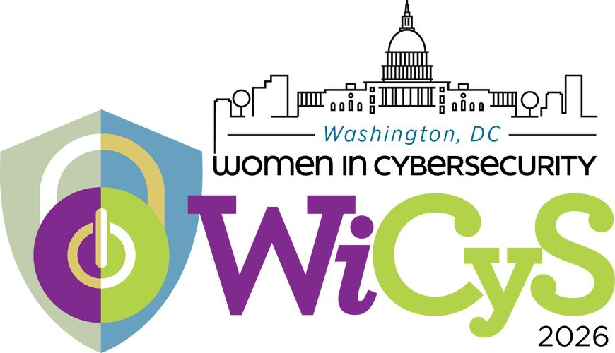
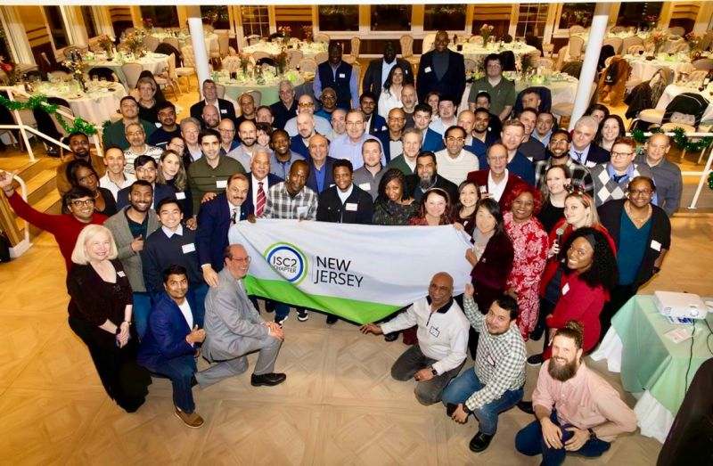
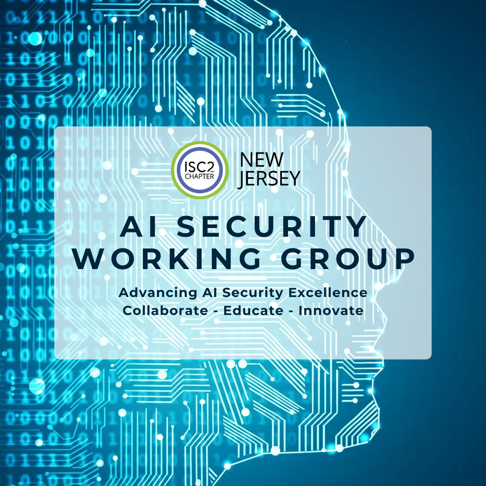
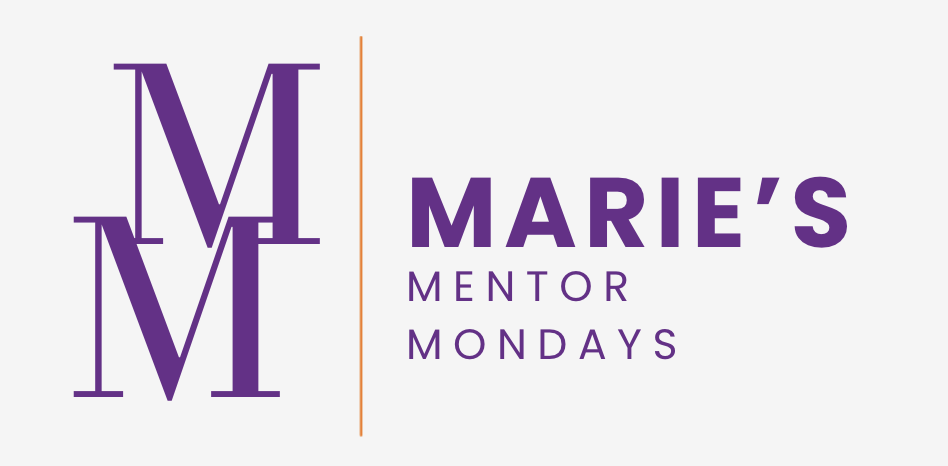

# 💫 About Me

Born to immigrant parents and raised in Metro Detroit, Michigan, I learned resilience early through financial hardship and community change. Those formative experiences taught me imagination and determination, qualities that continue to guide my work today.

With over 11 years as a cybersecurity and governance executive, I've built my career on a simple belief: security should accelerate business, not slow it down. My work focuses on translating complex regulations into frameworks that enable transformation, building teams that drive results, and ensuring organizations can innovate with confidence.

My advocacy for women in cybersecurity reflects a core commitment that leadership means creating pathways for others, powered by people and focused on lasting impact across industries.

---

## 💜 WiCyS Women in Cybersecurity

I'm a member of **[Women in Cybersecurity (WiCyS)](https://www.wicys.org/)** and serve on the **Equity Advisory Committee (EAC)** providing strategic counsel to advance equity and inclusion within the cybersecurity community, developing organizational policies, reviewing programs through an equity lens, and delivering quarterly recommendations to the Board of Directors.

### 🎤 Speaking at WiCyS 2026 Washington, DC

My first WiCyS conference is going to be an unforgettable one, and I'm still pinching myself. I was awarded a scholarship to attend WiCyS 2026, and on March 12th I'll be presenting alongside my amazing EAC colleagues on breaking the invisible barriers that keep underrepresented professionals from reaching leadership in cybersecurity.
This topic is personal to me. I can't wait to be in a room full of people who get it, learning from industry leaders, connecting with fellow professionals, and being part of a community that's actively doing the work.
Thank you to WiCyS and the scholarship sponsors for investing in women in cybersecurity and creating pathways for greater representation in this field. Washington, DC, here we come! 🙌

`Equity` `Inclusion` `Leadership` `Women in Cybersecurity` `Public Speaking`

---

## 💚 ISC2 New Jersey Chapter Volunteer

 

I've been a volunteer with the **[ISC2 New Jersey Chapter](https://isc2chapter-newjersey.org/)** for nearly two years, and joining this community was one of the best professional decisions I've ever made. When I first joined, the chapter was ~400 members strong. Today we've more than doubled in size, and it's not hard to see why.

Cybersecurity isn't just a job. It's a way of life. We think differently, through a lens of risk, resilience, and responsibility. What makes this chapter special is the authentic relationships built on trust and a shared commitment to the profession and to lifting each other up.

### 🤖 Founder, AI Security Working Group

I founded the **AI Security Working Group** for the ISC2 NJ Chapter, focused on advancing AI security excellence through collaboration, education, and innovation across the cybersecurity community.

I also participate in the **Mentoring Committee**, helping connect and support the next generation of cybersecurity professionals in New Jersey.

> *"If you are free then you need to free somebody else. If you have some power, then your job is to empower somebody else."* - Toni Morrison

`ISC2` `Community` `AI Security` `Mentorship` `Volunteering`

---

## 🚀 Featured Projects

### 🛡️ ISC2 NJ Cybersecurity Mentoring Toolkit

A local-first web app built for the ISC2 New Jersey Chapter's Cyber Pathways Mentoring Program. Designed as a cybersecurity-specialized alternative to generic platforms, with cyber-specific career tracks, curated certifications, SMART goal worksheets, session logs, and email templates. Runs entirely in the browser with no accounts, no tracking, and no server.

**[→ Open the App](https://thecyberleader.github.io/isc2nj-mentoring-toolkit/)** · [GitHub](https://github.com/TheCyberLeader/isc2nj-mentoring-toolkit)

`React` `Vite` `Tailwind CSS` `localStorage` `GitHub Pages`

---

### 🍳 Marie's Recipe Collection

A personal recipe webapp with adjustable servings, a shopping list builder, and nutrition info, built in memory of my Teta (grandmother), who passed away recently and believed deeply that recipes are meant to be shared.

My love of cooking comes from her. She taught me that cooking is more than following instructions, it's about the simple, beautiful rhythms of daily life, thinking of others, and creating something with love. This is my way of honoring her and continuing what she taught me: that food connects us, that cooking is an act of care, and that the best meals are the ones we share.

*Sahtain! (صحتين) — "Two healths" in Arabic, wishing you double the health and enjoyment.*

**[→ Open the App](https://thecyberleader.github.io/recipes/)** · [GitHub](https://github.com/TheCyberLeader/recipes)

`JavaScript` `GitHub Pages` `Node.js`

---

### 📚 Hands-On Cyber Leadership

A hands-on showcase developed as part of the WiCyS / Google Cybersecurity Certificate Program, presented through the lens of a governance and risk-aware cybersecurity leader.

- Security Audits & Compliance: NIST-based security audits, risk assessments, and compliance mapping
- Incident Response: Multi-scenario threat analysis including DNS failures, DoS attacks, brute force attempts, ransomware, and phishing incidents
- Technical Security Operations: Linux/SQL security operations, file permissions management, and security investigations
- Risk & Vulnerability Management: Threat modeling using PASTA Framework, NIST SP 800-30 risk quantification, and access control design
- Security Automation: Python-based automation for log parsing, pattern matching, and security algorithm development
- SOC Analyst Workflows: Alert triage, log analysis, and threat intelligence integration using NIST IR Lifecycle

[GitHub](https://github.com/TheCyberLeader/hands-on-cyber-leadership)

---

## 🎓 Marie's Mentor Mondays

  

Every Monday I share on Linkedin career insights, answer student questions, and offer practical advice for navigating tech and cybersecurity careers, because access to honest career guidance shouldn't depend on who you know.

`Mentorship` `Career Development` `Students` `Tech Careers`

---

## 🌍 Open Source & Community

### OWASP Project Nest — GSoC Mentor

[OWASP Nest](https://github.com/OWASP/Nest) is the central hub for the OWASP community, a platform for discovering projects, finding contribution opportunities, and powering Google Summer of Code. I serve as a **GSoC mentor**, guiding students contributing to one of the most widely used open source security community platforms in the world.

`Open Source` `Security` `Mentorship` `OWASP` `GSoC`

---

### SOC 2 Quality Guild — Community Member

[s2guild.org](https://s2guild.org) is a practitioner-driven community building standardized evaluation criteria for SOC 2 report reliability, helping GRC and TPRM teams make more consistent, defensible vendor trust decisions. I contribute as a community member bringing a governance and compliance practitioner perspective.

`GRC` `TPRM` `SOC2` `Compliance` `Open Source`

---

## 💻 Tech Stack

### Security & Compliance Frameworks

### Cloud & Infrastructure

### Programming & Scripting

### Security Tools & Analysis

### Development & Collaboration

### Design & Documentation

---

## 🌐 Connect

