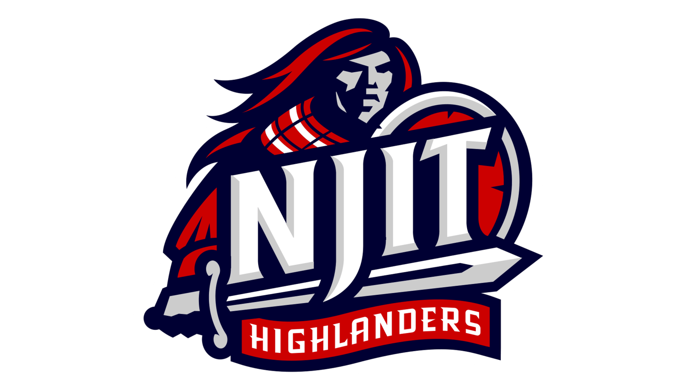
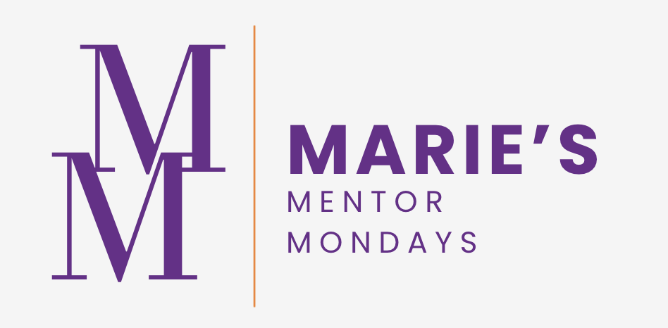

# 💫 About Me

Born to immigrant parents and raised in Metro Detroit, Michigan, I learned resilience early through financial hardship and community change. Those formative experiences taught me imagination and determination, qualities that continue to guide my work today.

With extensive experience as a cybersecurity and governance leader in pharma and life sciences, I've built my career on a simple belief: security should accelerate business, not slow it down. A builder, connector, and leader, my work focuses on translating complex regulations into frameworks that enable transformation, developing teams that drive results, and ensuring organizations can innovate with confidence.

My advocacy for women in cybersecurity reflects a core commitment that leadership means creating pathways for others, powered by people and focused on lasting impact across industries

---

## 💜 WiCyS Women in Cybersecurity

I'm a member of **[Women in Cybersecurity (WiCyS)](https://www.wicys.org/)** and serve on the **Equity Advisory Committee (EAC)** providing strategic counsel to advance equity and inclusion within the cybersecurity community, developing organizational policies, reviewing programs through an equity lens, and delivering quarterly recommendations to the Board of Directors.

## 🌍 Open Source & Community

### OWASP Project Nest GSoC Mentor

[OWASP Nest](https://github.com/OWASP/Nest) is the central hub for the OWASP community, a platform for discovering projects, finding contribution opportunities, and powering Google Summer of Code. I serve as a **GSoC mentor**, guiding students contributing to one of the most widely used open source security community platforms in the world.

This is my first year mentoring with OWASP GSoC. I've reviewed proposals across multiple projects and developed a framework for giving feedback that's honest, 
specific, and leaves contributors with a clear path forward.

↓ See my GSoC Mentorship Guide below

`Open Source` `Security` `Mentorship` `OWASP` `GSoC`

---

### SOC 2 Quality Guild Community Member

[s2guild.org](https://s2guild.org) is a practitioner-driven community building standardized evaluation criteria for SOC 2 report reliability, helping GRC and TPRM teams make more consistent, defensible vendor trust decisions. I contribute as a community member bringing a governance and compliance practitioner perspective.

`GRC` `TPRM` `SOC2` `Compliance` `Open Source`

---

### 🎓 NJIT Ying Wu College of Computing — Capstone Judge

  

Invited to serve as an industry judge for the **Ying Wu College of Computing Student Capstone Showcase** at New Jersey Institute of Technology (NJIT) — my alma mater. Evaluated final-year student projects across cybersecurity, software engineering, and computing disciplines, bringing an industry lens on security design, risk, and real-world applicability.

Giving back to the institution that shaped my career, and paying it forward to the next generation of computing professionals.

`NJIT` `Alumni` `Capstone Judge` `Cybersecurity` `Student Showcase`

## 🎓 GSoC Mentorship Guide

*For first-time GSoC contributors applying to OWASP projects - especially OWASP Nest.*

I started writing this after reviewing proposals this cycle because I kept seeing 
the same gaps in otherwise strong submissions. This isn't an official rubric,
it's what I actually look for, and what I wish more applicants knew before hitting submit.

---

### How I Structure My Review

I read every proposal twice. First pass: do I believe this person has actually 
looked at the codebase? Second pass: can I see exactly what will be built, by when, 
and how we'll know it's done?

Most proposals clear one bar but not both.

---

### What I'm Actually Looking For

**1. Codebase fluency, not just a good idea**

A compelling feature concept doesn't mean much if the architecture assumes the 
wrong stack. OWASP Nest runs on Django + Ninja, serves data through Strawberry 
GraphQL, uses Django-RQ for background tasks, and has existing models you should 
know about before you propose new ones.

Strong proposals reference specific files, models, or patterns in the actual repo. 
They say "I'll build on the existing Badge model and contribution_data JSONField" 
not "I'll create a badge system." That one sentence tells me you've done the work.

**2. A timeline that actually adds up**

The coding period is fixed. The hour budget is fixed (175hrs for medium, 350hrs 
for large). Your weekly milestones need to fit inside those constraints and 
reviewers will check.

Break your work into phases. Give each phase a week range and a concrete deliverable. 
Annotate with approximate hours. If your scope exceeds the project size listed, 
either trim it or ask your mentor directly whether a larger submission would be 
supported don't just ignore the mismatch and hope no one notices.

**3. Deliverables you can actually evaluate**

"Improved visual consistency" is not a deliverable. "8 core UI components refactored 
to the design system with Lighthouse accessibility score ≥ 90" is.

At the end of the summer, your mentor should be able to look at your proposal and 
say yes or no to each item. Write for that moment.

**4. The collaboration section (don't skip this)**

Every proposal needs: your timezone, your weekly availability in hours, any exams 
or commitments that fall during May–August, and how you plan to communicate with 
mentors. This isn't bureaucratic mentors plan milestone check-ins around this 
information. Leaving it out makes your proposal feel unfinished regardless of how 
strong the technical sections are.

**5. Stretch goals are your friend**

If you're excited about a feature but haven't thought through the implementation 
details move it to a stretch goal. A thin deliverable that looks like an 
unexamined commitment hurts your proposal. A well-labeled stretch goal shows 
self-awareness and scope discipline.

---

### What Makes a Proposal Stand Out

Across the proposals I've reviewed, the ones that stand out share a few things:

- They show prior contributions even one merged PR signals genuine engagement
- They reference related work: how have others solved similar problems? What can 
  we learn from GitHub's activity feed, GitLab's event stream, or comparable tools?
- They commit to the stack. "Likely Python (Django)/Node" is not a tech choice — 
  pick one and own it
- They flag real risks and propose mitigations: design disagreements, test 
  regressions, API rate limits, scope creep
- They ask good questions before submitting confirming infrastructure dependencies 
  with maintainers, clarifying project size, checking whether a stretch goal is 
  in or out of scope

---

### For First-Time Contributors

GSoC is competitive, but it rewards preparation more than brilliance. The applicants 
who do best aren't necessarily the most experienced they're the ones who engaged 
with the project early, asked thoughtful questions in the community, read the 
existing code before writing a single line of their proposal, and revised based 
on feedback.

If a mentor takes time to give you early feedback, use it. A revised draft that 
addresses every point of feedback is itself a signal about how you'll work across 
a whole summer.

And if you don't get in this year the contributions you made while applying 
are real. They count. Come back.

---

*This guide will grow as I learn more from the mentoring experience. Last updated: March 2026.*

---

## 🚀 Featured Projects

### 🍳 Marie's Recipe Collection

A personal recipe webapp with adjustable servings, a shopping list builder, and nutrition info, built in memory of my Teta (grandmother), who passed away recently and believed deeply that recipes are meant to be shared.

My love of cooking comes from her. She taught me that cooking is more than following instructions, it's about the simple, beautiful rhythms of daily life, thinking of others, and creating something with love. This is my way of honoring her and continuing what she taught me: that food connects us, that cooking is an act of care, and that the best meals are the ones we share.

*Sahtain! (صحتين) — "Two healths" in Arabic, wishing you double the health and enjoyment.*

**[→ Open the App](https://thecyberleader.github.io/recipes/)** · [GitHub](https://github.com/TheCyberLeader/recipes)

`JavaScript` `GitHub Pages` `Node.js`

---

### 📚 Hands-On Cyber Leadership

A hands-on showcase developed as part of the WiCyS / Google Cybersecurity Certificate Program, presented through the lens of a governance and risk-aware cybersecurity leader.

- Security Audits & Compliance: NIST-based security audits, risk assessments, and compliance mapping
- Incident Response: Multi-scenario threat analysis including DNS failures, DoS attacks, brute force attempts, ransomware, and phishing incidents
- Technical Security Operations: Linux/SQL security operations, file permissions management, and security investigations
- Risk & Vulnerability Management: Threat modeling using PASTA Framework, NIST SP 800-30 risk quantification, and access control design
- Security Automation: Python-based automation for log parsing, pattern matching, and security algorithm development
- SOC Analyst Workflows: Alert triage, log analysis, and threat intelligence integration using NIST IR Lifecycle

[GitHub](https://github.com/TheCyberLeader/hands-on-cyber-leadership)

---

## 🎓 Marie's Mentor Mondays

  

Monthly on LinkedIn I share career insights, answer questions from students and professionals, and offer practical advice for navigating tech and cybersecurity careers; because honest guidance shouldn't depend on who you know.

**[Follow Marie's Mentor Mondays on LinkedIn](https://www.linkedin.com/company/marie-s-mentor-mondays/)**

`Mentorship` `Career Development` `Students` `Tech Careers`

---

## 💻 Tech Stack

### Security & Compliance Frameworks

### Cloud & Infrastructure

### Programming & Scripting

### Security Tools & Analysis

### Development & Collaboration

### Design & Documentation

---
